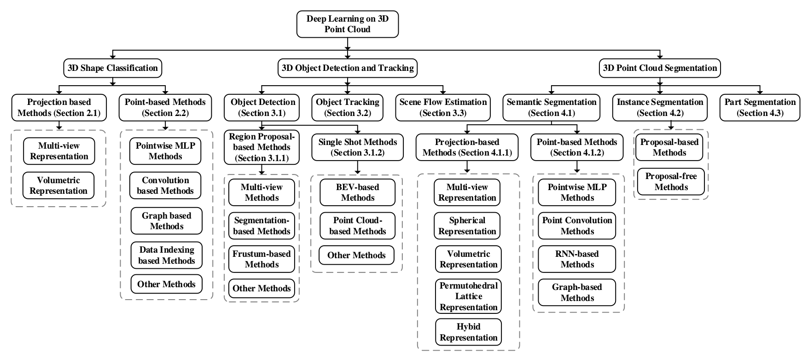
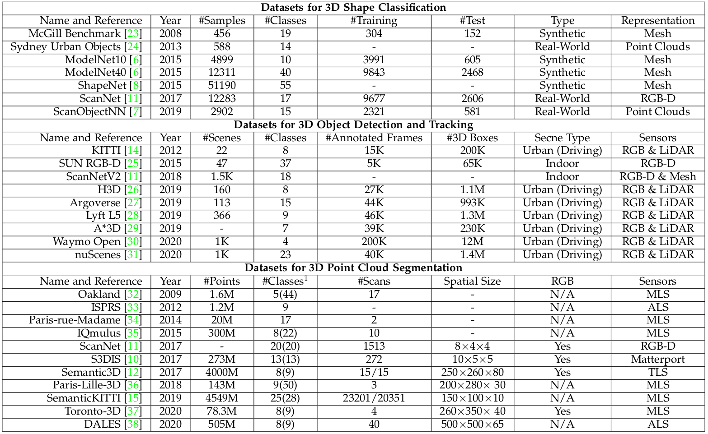

# Deep Learning for 3D Point Clouds: A Survey (IEEE TPAMI, 2020)

This is the official repository of **Deep Learning for 3D Point Clouds: A Survey** (IEEE TPAMI), a comprehensive survey 
of recent progress in deep learning methods for point clouds. For details, please refer to:
 
**Deep Learning for 3D Point Clouds: A Survey**  

[Yulan Guo∗](http://yulanguo.me/), 
[Hanyun Wang∗](https://scholar.google.com.hk/citations?user=QG3LdUcAAAAJ&hl=zh-CN), 
[Qingyong Hu∗](https://qingyonghu.github.io/), Hao Liu∗,
[Li Liu](http://www.ee.oulu.fi/~lili/LiLiuHomepage.html), 
and [Mohammed Bennamoun](http://staffhome.ecm.uwa.edu.au/~00051632/).  
(* *indicates equal contribution*)

**[[Paper](https://arxiv.org/abs/1912.12033)] [[Blog](https://mp.weixin.qq.com/s/5RJAv_cOlhee1R9uZzkmHQ)]**  

  

## Introduction
We present a comprehensive review of recent deep learning methods for point clouds. It covers major tasks in 3D point cloud analysis, 
including 3D shape classification, 3D object detection, and 3D point cloud segmentation. It also presents comparative 
results on several publicly available datasets, together with insightful observations and inspiring future research directions.
Please feel free to <a href="mailto:qingyong.hu@cs.ox.ac.uk">contact me</a> 
or [create an issue](https://help.github.com/en/github/managing-your-work-on-github/creating-an-issue) on this page if you have new results to add or any suggestions! 

We will update this page on a regular basis! So stay tuned~ :tada::tada::tada:

### (1) Datasets

  

### (2) 3D Shape Classification
#### Public Datasets
- ModelNet (CVPR'15) [[paper]](http://3dvision.princeton.edu/projects/2014/3DShapeNets/paper.pdf) [[project page]](http://modelnet.cs.princeton.edu/)
    - ModelNet10 [[data]](http://3dvision.princeton.edu/projects/2014/3DShapeNets/ModelNet10.zip) [[results]](http://modelnet.cs.princeton.edu/) 
    - ModelNet40 [[data]](http://modelnet.cs.princeton.edu/ModelNet40.zip) [[results]](http://modelnet.cs.princeton.edu/) 
- PartNet (CVPR'19) [[paper]](https://arxiv.org/abs/1812.02713) [[data]](https://github.com/daerduoCarey/partnet_dataset) [[project page]](https://cs.stanford.edu/~kaichun/partnet/)
- ScanObjectNN (ICCV'19) [[paper]](https://arxiv.org/pdf/1908.04616.pdf) [[data]](https://github.com/hkust-vgd/scanobjectnn) [[project page]](https://hkust-vgd.github.io/scanobjectnn/)

#### Benchmark Results

  

### (3) 3D Object Detection
#### Public Datasets
- KITTI (CVPR'12) [[paper]](http://www.cvlibs.net/publications/Geiger2012CVPR.pdf) [[project page]](http://www.cvlibs.net/datasets/kitti/eval_3dobject.php)
    - _3D objecct detection_ [[data]](http://www.cvlibs.net/datasets/kitti/eval_object.php?obj_benchmark=3d) [[results]](http://www.cvlibs.net/datasets/kitti/eval_object.php?obj_benchmark=3d)
    - _BEV_ [[data]](http://www.cvlibs.net/datasets/kitti/eval_object.php?obj_benchmark=bev) [[results]](http://www.cvlibs.net/datasets/kitti/eval_object.php?obj_benchmark=bev)
- ApolloScape (TPAMI'19) [[paper]](http://ad-apolloscape.bj.bcebos.com/public%2FApolloScape%20Dataset.pdf) [[data]](http://apolloscape.auto/tracking.html#to_data_href) [[results]](http://apolloscape.auto/leader_board.html)
- Argoverse (CVPR'19) [[paper]](http://openaccess.thecvf.com/content_CVPR_2019/papers/Chang_Argoverse_3D_Tracking_and_Forecasting_With_Rich_Maps_CVPR_2019_paper.pdf) [[data]](https://www.argoverse.org/data.html#download-link) [[project page]](https://www.argoverse.org/index.html)
- A*3D (arXiv'19) [[paper]](https://arxiv.org/pdf/1909.07541) [[data]](https://github.com/I2RDL2/ASTAR-3D#Download) [[project page]](https://github.com/I2RDL2/ASTAR-3D)
- Waymo (arXiv'19) [[paper]](https://arxiv.org/pdf/1912.04838) [[data]](https://waymo.com/open/licensing/) [[project page]](https://waymo.com/open/)

#### Benchmark Results

  

  

### (4) 3D Point Cloud Segmentation
#### Public Datasets
- Semantic3D (ISPRS'17) [[paper]](https://www.ethz.ch/content/dam/ethz/special-interest/baug/igp/photogrammetry-remote-sensing-dam/documents/pdf/Papers/Hackel-etal-cmrt2017.pdf) [[project page]](http://www.semantic3d.net/)
    - _semantic-8_ [[data]](http://www.semantic3d.net/view_dbase.php?chl=1#download) [[results]](http://www.semantic3d.net/view_results.php?chl=1)
    - _reduced-8_ [[data]](http://www.semantic3d.net/view_dbase.php?chl=2#download) [[results]](http://www.semantic3d.net/view_results.php?chl=2)
- S3DIS (CVPR'17) [[paper]](http://buildingparser.stanford.edu/images/3D_Semantic_Parsing.pdf) [[data]](https://docs.google.com/forms/d/e/1FAIpQLScDimvNMCGhy_rmBA2gHfDu3naktRm6A8BPwAWWDv-Uhm6Shw/viewform?c=0&w=1) [[project page]](http://buildingparser.stanford.edu/dataset.html#Download)
- ScanNet (CVPR'17) [[paper]](https://arxiv.org/pdf/1702.04405) [[data]](https://github.com/ScanNet/ScanNet) [[project page]](http://www.scan-net.org/) [[results]](http://kaldir.vc.in.tum.de/scannet_benchmark/)  
- NPM3D (IJRR'18) [[paper]](https://arxiv.org/pdf/1712.00032) [[data]](https://cloud.mines-paristech.fr/index.php/s/JhIxgyt0ALgRZ1O) [[project page]](http://npm3d.fr/) [[results]](http://npm3d.fr/paris-lille-3d) 
- DublinCity (BMVC'19) [[paper]](https://arxiv.org/abs/1909.03613) [[data]](https://v-sense.scss.tcd.ie/dublincity/) [[project page]](https://v-sense.scss.tcd.ie/dublincity/) 
- SemanticKITTI (ICCV'19) [[paper]](https://arxiv.org/pdf/1904.01416) [[data]](http://semantic-kitti.org/dataset.html#download) [[project page]](http://semantic-kitti.org/index.html) [[results]](https://competitions.codalab.org/competitions/20331#results)
- nuScenes (CVPR'20) [[paper]](https://arxiv.org/abs/1903.11027) [[data]](https://www.nuscenes.org/lidar-segmentation) [[project page]](https://www.nuscenes.org/lidar-segmentation) [[results]](https://www.nuscenes.org/lidar-segmentation)
- Toronto-3D (CVPRW'20) [[paper]](https://arxiv.org/abs/2003.08284) [[data]](https://github.com/WeikaiTan/Toronto-3D) [[project page]](https://github.com/WeikaiTan/Toronto-3D) [[results]](https://github.com/WeikaiTan/Toronto-3D)
- DALES (CVPRW'20) [[paper]](https://arxiv.org/abs/2004.11985) [[data]](https://docs.google.com/forms/d/e/1FAIpQLSe3IaTxCS7wKH01SHn_o7U86ToIw9K26vc0bkwiELn6wwh8gg/viewform) [[project page]](https://udayton.edu/engineering/research/centers/vision_lab/research/was_data_analysis_and_processing/dale.php) [[results]](https://arxiv.org/abs/2004.11985)
- Campus3D (ACM MM'20) [[paper]](https://arxiv.org/abs/2008.04968) [[data]](https://3d.dataset.site/) [[project page]](https://github.com/shinke-li/Campus3D) [[results]](https://arxiv.org/abs/2008.04968)
- SensatUrban (CVPR'21) [[paper]](https://arxiv.org/abs/2009.03137) [data][[project page]](http://point-cloud-analysis.cs.ox.ac.uk/) [[results]](https://arxiv.org/abs/2009.03137)

#### Benchmark Results

  

### Citation
If you find our work useful in your research, please consider citing:

    @article{guo2020deep,
      title={Deep learning for 3d point clouds: A survey},
      author={Guo, Yulan and Wang, Hanyun and Hu, Qingyong and Liu, Hao and Liu, Li and Bennamoun, Mohammed},
      journal={IEEE transactions on pattern analysis and machine intelligence},
      year={2020},
      publisher={IEEE}
    }

## Updates
* 26/02/2020: Adding the dataset information
* 27/12/2019: Initial release.

## Related Repos
1. [RandLA-Net: Efficient Semantic Segmentation of Large-Scale Point Clouds](https://github.com/QingyongHu/RandLA-Net) 
2. [SensatUrban: Learning Semantics from Urban-Scale Photogrammetric Point Clouds](https://github.com/QingyongHu/SpinNet) 
3. [3D-BoNet: Learning Object Bounding Boxes for 3D Instance Segmentation on Point Clouds](https://github.com/Yang7879/3D-BoNet) 
4. [SpinNet: Learning a General Surface Descriptor for 3D Point Cloud Registration](https://github.com/QingyongHu/SpinNet) 

