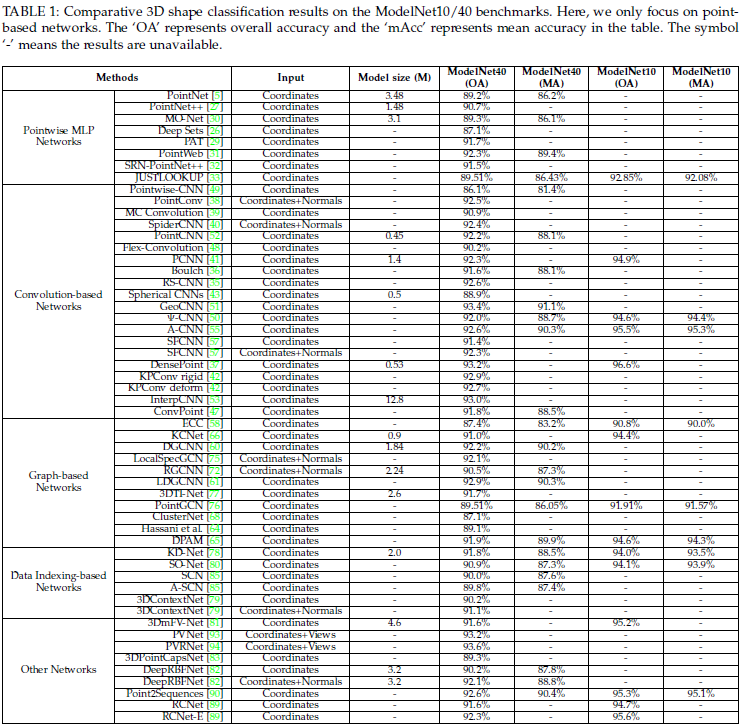
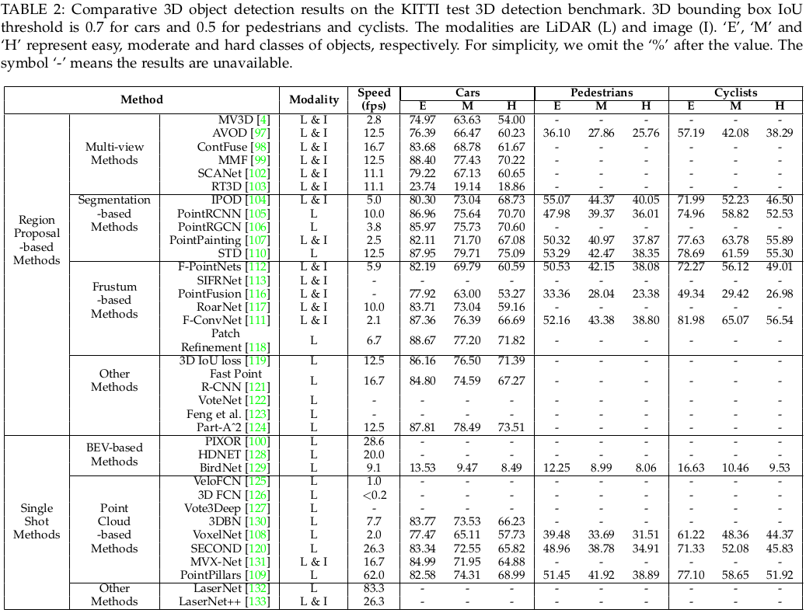
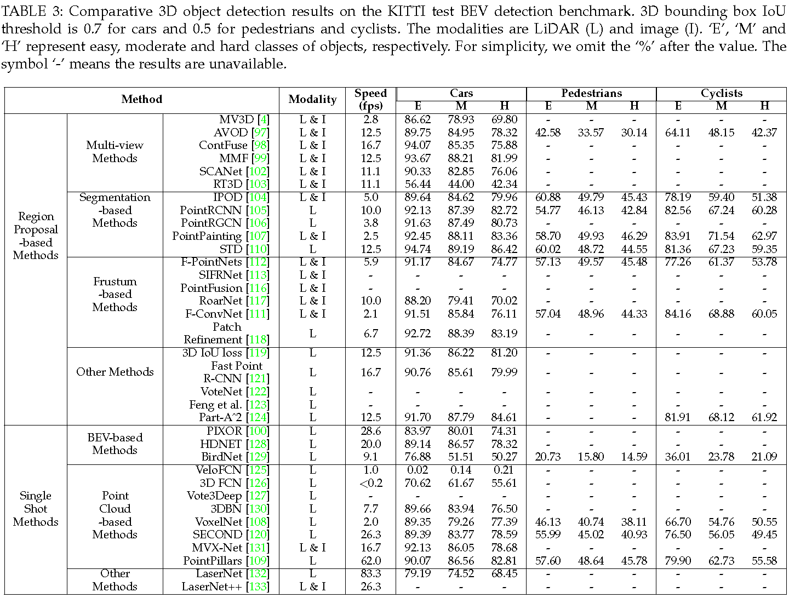
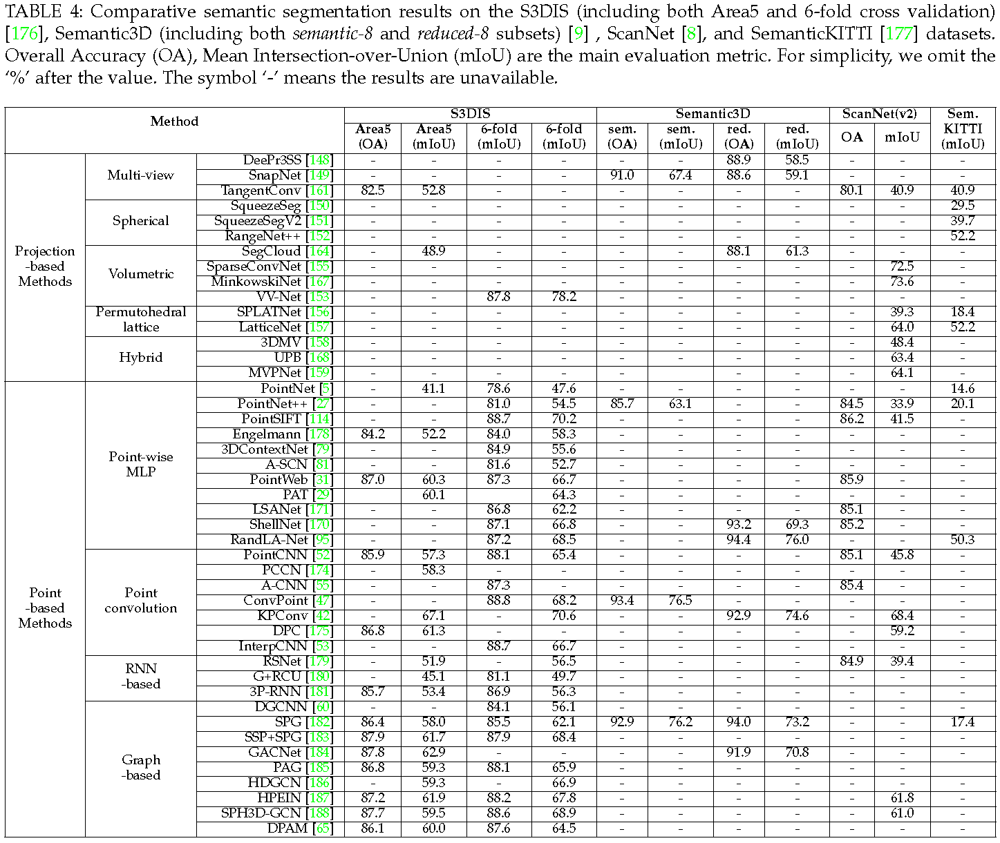

## Deep Learning for 3D Point Clouds: A Survey

Yulan Guo∗, Hanyun Wang∗,  Qingyong Hu∗,  Hao Liu∗,  Li Liu,  and Mohammed Bennamoun. [arXiv:1912.12033](https://arxiv.org/abs/1912.12033), 2019. 

This repository provides the **benchmark results** of existing methods. 

**Updated on a regular basis~** :tada::tada::tada:

### (1) 3D Shape Classification

  

### (2) 3D Object Detection

  

  

### (3) 3D Point Cloud Segmentation

  

### Citation
If you find our work useful in your research, please consider citing:

	@article{guo2019deep,
	  title={Deep Learning for 3D Point Clouds: A Survey},
	  author={Guo, Yulan and Wang, Hanyun and Hu, Qingyong and Liu, Hao and Liu, Li and Bennamoun, Mohammed},
	  journal={arXiv preprint arXiv:1912.12033},
	  year={2019}
	}
