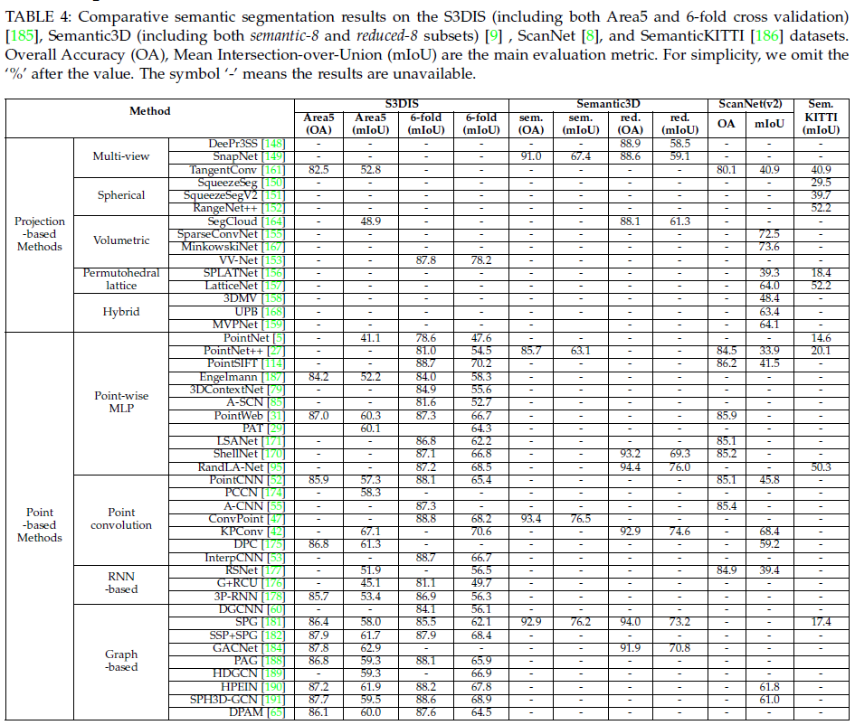

## Deep Learning for 3D Point Clouds: A Survey

Yulan Guo∗, Hanyun Wang∗,  Qingyong Hu∗,  Hao Liu∗,  Li Liu,  and Mohammed Bennamoun. [arXiv:1906.01140](https://arxiv.org/abs/1906.01140), 2019. 

This repository provides the **benchmark results** of existing methods. 

**Updated on a regular basis**. :tada::tada::tada:

### (1) 3D Shape Classification

  

### (2) 3D Object Detection

  

  

### (3) 3D Point Cloud Segmentation

  

